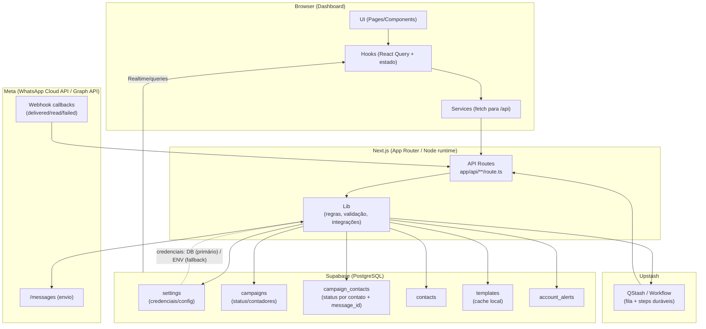
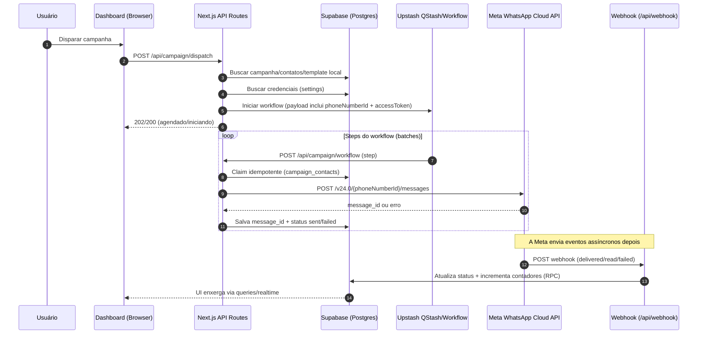
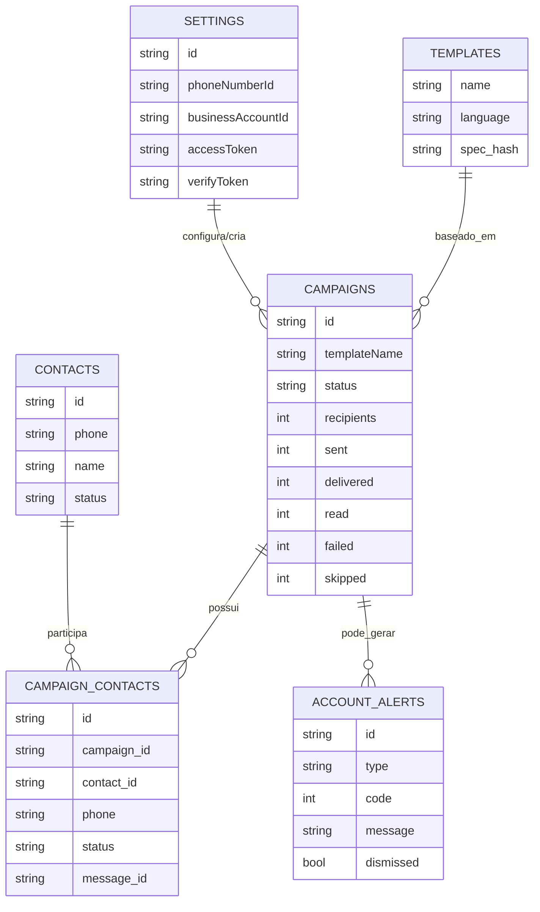

# SmartZap (SaaS de automação WhatsApp)

<div align="center">


CRM + automação de campanhas no WhatsApp (Cloud API), com fila/workflows (Upstash QStash) e geração de conteúdo via IA.

<p align="center">
   <a href="docs/GUIA_CONFIGURACAO.md">
      
   </a>
</p>

</div>

---

## Navegação rápida

- **Guia (produção)**: [docs/GUIA_CONFIGURACAO.md](docs/GUIA_CONFIGURACAO.md)
- **Guia (local / dev)**: [docs/GUIA_DE_INSTALACAO.md](docs/GUIA_DE_INSTALACAO.md)
- **Arquitetura**: [UI → API → filas → Meta → webhook → DB](#arquitetura-primeiro-como-tudo-se-conecta)
- **Rodar local**: [Como rodar localmente](#como-rodar-localmente)
- **Docs internas**: [Documentação interna](#documentacao-interna)

> [!IMPORTANT]
> Segurança: não comite segredos. Se você for adicionar prints na pasta `docs/`, use imagens sanitizadas (existe `scripts/redact_docs_images.py` e `scripts/scan-secrets.mjs`).

## TL;DR (como começar)

Escolha seu caminho:

### Produção (recomendado: Vercel + Wizard)

- Siga o guia completo: **[docs/GUIA_CONFIGURACAO.md](docs/GUIA_CONFIGURACAO.md)**
- Você vai usar o Wizard em `/setup` para configurar Supabase + QStash (+ WhatsApp opcional).

### Local (dev)

- Siga o guia rápido: **[docs/GUIA_DE_INSTALACAO.md](docs/GUIA_DE_INSTALACAO.md)**
- Em geral: instalar deps → `.env.local` → `npm run dev`.

> [!TIP]
> Se você for rodar o Wizard em produção, prefira o domínio principal `https://SEU-PROJETO.vercel.app` (Production) — não o link de Preview.

## O que é

O SmartZap é uma aplicação full-stack (Next.js App Router) que permite:

- gerenciar **contatos** e campos personalizados;
- visualizar/sincronizar/criar **templates** do WhatsApp;
- criar e disparar **campanhas** (envio em massa) com pré-validação;
- acompanhar **métricas** e alertas de conta;
- configurar integrações (Supabase, Meta, Upstash, IA) por variáveis de ambiente e/ou wizard.

Este repositório também é usado como base educacional. A pasta `tmp/` pode conter materiais extras e utilitários.

## Stack

- **Frontend**: Next.js 16, React 19, Tailwind CSS v4, shadcn/ui + Radix.
- **Backend**: API Routes (Next.js, runtime Node.js) + integrações externas.
- **Banco**: Supabase (PostgreSQL).
- **Fila/Workflows**: Upstash QStash.
- **IA**: Vercel AI SDK v6 com suporte a Gemini/OpenAI/Anthropic.
- **WhatsApp**: Meta WhatsApp Cloud API (Graph API v24+).

## Arquitetura (primeiro: como tudo se conecta)

Esta seção existe para responder rapidamente:

- **quem chama quem** (UI → API → filas → Meta → webhook → DB → UI)
- **onde cada dado mora** (o que é fonte da verdade vs cache)
- **onde ficam as integrações** (Supabase, Upstash/QStash, Meta)

> O GitHub renderiza Mermaid em Markdown usando blocos ` ```mermaid `.

### Mapa de serviços (UI → Next.js → Upstash → Meta → Supabase)



<details>
  <summary><strong>Fluxo de campanha (do clique ao webhook)</strong></summary>



</details>

<details>
  <summary><strong>Modelo mental do banco (o que persiste)</strong></summary>

O relacionamento que amarra tudo em campanhas é:

`campaigns` → `campaign_contacts` (por contato, com `message_id`) → atualizado por workflow e pelo webhook.



</details>

### Como navegar no código (Page → Hook → Service → API)

### Padrão de frontend (Page → Hook → Service → API)

Em geral, as telas seguem o padrão:

- `app/(dashboard)/**/page.tsx`: página “fina” que apenas conecta dados/handlers.
- `hooks/**`: controller hooks (React Query + estado de UI).
- `services/**`: client de API (fetch para rotas em `app/api/**`).
- `app/api/**/route.ts`: rotas server-side (validação, DB, integrações).

### Pastas principais

```txt
app/                  # Next.js App Router (páginas + API)
components/            # UI (shadcn) e views por feature
hooks/                 # Controller hooks (React Query)
services/              # Camada de acesso às rotas da API
lib/                   # Regras de negócio, utilitários e integrações
supabase/              # Migrations/artefatos do banco
scripts/               # Scripts utilitários (dev/ops)
```

## Como rodar localmente

> [!TIP]
> Quer o caminho mais curto para rodar local? Siga: **[docs/GUIA_DE_INSTALACAO.md](docs/GUIA_DE_INSTALACAO.md)**.

<details>
   <summary><strong>Ver passo a passo completo (local)</strong></summary>

### Pré-requisitos

- Node.js 20+ (recomendado)
- Conta no Supabase (para o banco)
- Conta no Meta (WhatsApp Cloud API) para uso real
- Conta no Upstash (QStash) para disparos em lote

### 1) Instalar dependências

```bash
npm install
```

### 2) Configurar variáveis de ambiente

Copie o arquivo de exemplo:

```bash
cp .env.example .env.local
```

Preencha os valores no `.env.local`. O arquivo `.env.example` já descreve cada variável.

Principais variáveis (resumo):

- **Supabase**: `NEXT_PUBLIC_SUPABASE_URL`, `NEXT_PUBLIC_SUPABASE_PUBLISHABLE_KEY`, `SUPABASE_SECRET_KEY`
- **WhatsApp Cloud API**: `WHATSAPP_TOKEN`, `WHATSAPP_PHONE_ID`, `WHATSAPP_BUSINESS_ACCOUNT_ID`
- **Webhook (verify token)**: preferencialmente via Supabase settings (`webhook_verify_token`) e, como fallback, `WEBHOOK_VERIFY_TOKEN`
- **Fila**: `QSTASH_TOKEN`
- **Segurança local**: `MASTER_PASSWORD`, `SMARTZAP_API_KEY`, `SMARTZAP_ADMIN_KEY`
- **IA (opcional)**: `GEMINI_API_KEY` (ou chaves de OpenAI/Anthropic)

### 3) Subir o servidor

```bash
npm run dev
```

Abra `http://localhost:3000`.

</details>

## Uso (fluxo recomendado)

1. Faça login (senha definida em `MASTER_PASSWORD`).
2. Vá em **Configurações** e conecte:
   - Supabase (se ainda não estiver configurado)
   - WhatsApp Cloud API
   - QStash (para campanhas)
   - IA (opcional)
3. Importe contatos (CSV) ou cadastre manualmente.
4. Sincronize/crie templates.
5. Crie uma campanha e rode o **precheck** antes do disparo.

## Comandos úteis

```bash
npm run dev
npm run lint
npm run build
npm run test
npm run test:e2e
```

## Deploy

O deploy padrão é na Vercel.

- Configure as variáveis de ambiente na Vercel (pode usar o wizard do app).
- Rode build para validar: `npm run build`.

## Troubleshooting

### “Supabase not configured. Complete setup at /setup”

As variáveis do Supabase não estão preenchidas (ou estão incorretas). Confira:

- `NEXT_PUBLIC_SUPABASE_URL`
- `NEXT_PUBLIC_SUPABASE_PUBLISHABLE_KEY` (publishable/anon)
- `SUPABASE_SECRET_KEY` (service role/secret — backend apenas)

### Erros de permissão/#200 no Meta

Geralmente indica token sem permissões adequadas.

### Rate limit por par (131056)

Isso acontece quando o envio para o mesmo destinatário ocorre rápido demais. O projeto inclui tratamento e tempos de espera recomendados.

---

## Documentação interna

Além deste README, veja:

- `docs/GUIA_CONFIGURACAO.md`
- `docs/guia.md`

