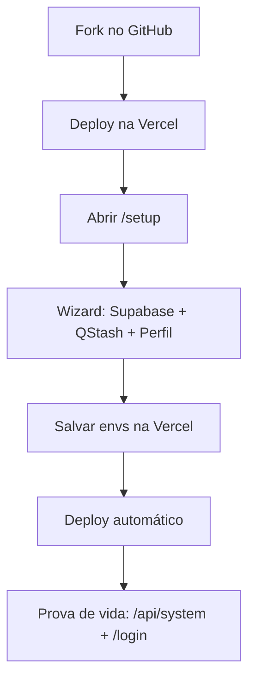

# SmartZap — Guia de Configuração (produção)

Este guia existe para uma coisa: colocar o SmartZap funcionando em **produção** com o menor atrito possível.

O caminho recomendado é **Vercel + Wizard** (sem mexer em terminal, sem configuração “na mão”).

> [!IMPORTANT]
> **Segurança:** os prints deste guia são **sanitizados** (tokens/chaves/e-mail/telefone mascarados). Se você adicionar imagens novas, **não comite segredos**.
> 
> Dica: existe um script para ajudar na sanitização: `scripts/redact_docs_images.py`.

> [!TIP]
> Se você quer rodar em localhost (apenas desenvolvimento), pule direto para: **[Apêndice: Desenvolvimento local (opcional)](#apendice-desenvolvimento-local-opcional)**.

---

## TL;DR (30–45 min)

- [ ] Fazer fork do repositório no GitHub.
- [ ] Deploy na Vercel.
- [ ] Pegar credenciais (Supabase + QStash + Token da Vercel).
- [ ] Rodar o Wizard em `https://SEU-PROJETO.vercel.app/setup`.
- [ ] Validar a “prova de vida” em `https://SEU-PROJETO.vercel.app/api/system`.

---

## Sumário

- [Pré-requisitos](#pre-requisitos)
- [Vercel + Wizard (recomendado)](#vercel--wizard-recomendado)
    - [1. Fork no GitHub](#1-fork-no-github)
    - [2. Deploy na Vercel](#2-deploy-na-vercel)
    - [3. Coletar credenciais](#3-coletar-credenciais)
    - [4. Rodar o Wizard](#4-rodar-o-wizard)
    - [5. Finalizar e logar](#5-finalizar-e-logar)
    - [6. Prova de vida (produção)](#6-prova-de-vida-producao)
- [Troubleshooting (produção)](#troubleshooting)
- [Apêndice: prints (sanitizados)](#apendice-prints)
- [Apêndice: Desenvolvimento local (opcional)](#apendice-desenvolvimento-local-opcional)
- [Suporte](#suporte)

---

## Pré-requisitos

Crie conta (gratuita) e deixe aberto em outra aba:

| Serviço | Para quê | Link |
| --- | --- | --- |
| GitHub | Código / fork | <https://github.com> |
| Vercel | Deploy | <https://vercel.com> |
| Supabase | Banco de dados | <https://supabase.com> |
| Upstash (QStash) | Fila/workflows | <https://upstash.com> |

### Checklist antes de começar

- [ ] Tenho acesso a um **projeto Supabase** (URL + keys).
- [ ] Tenho acesso a um **token QStash** (Upstash).
- [ ] Vou criar um **token da Vercel** (aparece 1 vez).
- [ ] Estou no domínio **Production** do projeto na Vercel (não Preview).

---

## Vercel + Wizard (recomendado)

### 1. Fork no GitHub

Faça o fork:

- <https://github.com/thaleslaray/smartzap/fork>

    
<strong>Manter seu fork atualizado (opcional)</strong>

1. Abra seu repositório `smartzap` no GitHub.
2. Clique em **Sincronizar fork** → **Atualizar branch**.

Se você já alterou arquivos e ocorrer conflito, resolva com calma (ou peça ajuda) antes de continuar.

---

### 2. Deploy na Vercel

1. Acesse <https://vercel.com> e faça login.
2. **Add New → Project**.
3. Selecione o repositório `smartzap` (seu fork).
4. Clique em **Deploy**.

    
<strong>Ver prints do deploy (opcional)</strong>

1. **Add New Project**
     

2. **Importar repositório**
     

3. **Deploy**
     

4. **Dashboard**
     

5. **Domains (copiar URL)**
     

---

### 3. Coletar credenciais

Você vai usar estas chaves no Wizard.

> [!TIP]
> Se você preferir um caminho “sem automação”, dá para concluir o setup apenas com o botão **Ver SQL de Inicialização** (e executando no Supabase). A automação (connection string + “Conectar Banco”) é um atalho.

#### Supabase

1. Supabase → **Project Settings → API**.
2. Copie:
     - `Project URL` (ex.: `https://abc123.supabase.co`)
     - `NEXT_PUBLIC_SUPABASE_PUBLISHABLE_KEY=sb_publishable_...` (ou `NEXT_PUBLIC_SUPABASE_PUBLISHABLE_DEFAULT_KEY`)
     - `SUPABASE_SECRET_KEY=sb_secret_...`

3. (Recomendado) Supabase → **Project Settings → Database** → **Connection string**:
    - copie uma connection string do **Transaction pooler** (porta **6543**).
    - você vai colar isso no Wizard para habilitar o botão **Conectar Banco** (migração automática).

> Sem a connection string, o setup ainda funciona: você usa o botão **Ver SQL de Inicialização** e executa no **SQL Editor** do Supabase.

    
<strong>Ver print (opcional)</strong>

Se o Supabase pedir connection string, use “Transaction pooler”:

#### QStash (Upstash)

1. Upstash → **QStash**.
2. No bloco **Quickstart**, copie `QSTASH_TOKEN`.

    
<strong>Ver print (opcional)</strong>

> **Importante:** para este setup você só precisa do `QSTASH_TOKEN`.

Se você quiser ver métricas de uso dentro do painel (opcional), o Wizard também aceita:

- `UPSTASH_EMAIL`
- `UPSTASH_API_KEY`

#### Token da Vercel

1. Vercel → **Settings → Tokens**.
2. Crie um token com **Scope: Full Account**.
3. Copie o token (ele aparece uma única vez).

    
<strong>Ver prints (opcional)</strong>

#### WhatsApp (opcional)

Se você já tiver Meta/WhatsApp Cloud API:

- `WHATSAPP_TOKEN`
- `WHATSAPP_PHONE_ID`
- `WHATSAPP_BUSINESS_ACCOUNT_ID`

---

### 4. Rodar o Wizard

O Wizard é o instalador do SmartZap. Ele valida suas credenciais, configura variáveis de ambiente na Vercel e finaliza o banco.

Antes de começar, tenha em mãos:

| Item | Onde pegar |
| --- | --- |
| Token da Vercel | Vercel → Settings → Tokens |
| Supabase Project URL + Keys | Supabase → Project Settings → API |
| Supabase connection string (Transaction pooler 6543) | Supabase → Project Settings → Database |
| QStash token | Upstash → QStash → Quickstart |

**Começo (bootstrap):**

1. Abra: `https://SEU-PROJETO.vercel.app/setup`
2. Se aparecer a tela de token, siga o fluxo:
    - cole o **Token da Vercel**
    - confirme o **projeto** encontrado
    - você será redirecionado para: `/setup/wizard`

> Dica importante (Vercel): prefira abrir o Wizard no **domínio principal** do projeto (Production). Se você rodar o setup em um link de **Preview**, pode acabar configurando o ambiente errado.

> Se você fechou a aba no meio do processo, geralmente dá para continuar por aqui: `https://SEU-PROJETO.vercel.app/setup/wizard?resume=true`.

#### Checklist do Wizard

- [ ] Tenho o **Token da Vercel**.
- [ ] Tenho `NEXT_PUBLIC_SUPABASE_URL`.
- [ ] Tenho `NEXT_PUBLIC_SUPABASE_PUBLISHABLE_KEY` (ou `...DEFAULT_KEY`).
- [ ] Tenho `SUPABASE_SECRET_KEY`.
- [ ] Tenho `QSTASH_TOKEN`.
- [ ] (Opcional) Tenho a **Connection String** do Supabase (Connection Pooler/Transaction pooler, porta **6543**) para automação.

---

#### Tela a tela (bem detalhado)

##### 1) Senha (MASTER_PASSWORD)

O que preencher:

- **Senha**: mínimo **8 caracteres**
- **Confirmar senha**

O que isso faz:

- vira a variável `MASTER_PASSWORD`
- é a senha que você vai usar no `/login`

##### 2) Database (Supabase)

O que preencher:

- **Supabase URL**: `https://xxxx.supabase.co`
- **Publishable Key**: `sb_publishable_...` (ou a `...DEFAULT_KEY` equivalente)
- **Secret Key**: `sb_secret_...`

Depois disso, você tem dois caminhos (o Wizard suporta os dois):

**Opção A — manual (mais “à prova de bala”)**

1. Clique em **Ver SQL de Inicialização**.
2. Copie o SQL.
3. No Supabase Dashboard → **SQL Editor**, cole e execute.

**Opção B — automática (mais rápida)**

1. Cole a **connection string** do Supabase (Transaction pooler, porta **6543**) no campo de connection string.
2. Clique em **Conectar Banco**.

Se o Wizard detectar tabelas já existentes, ele vai te mostrar um aviso e habilitar ações:

- **Resetar Banco** (apaga e recria) → clique duas vezes (vira **Confirmar Reset**)
- seguir sem resetar (mantém e tenta migrar)

> [!IMPORTANT]
> Se você tiver erro 403/42501 depois, quase sempre é porque o SQL não foi executado até o fim (principalmente a parte de **PERMISSIONS/GRANTs**).

##### 3) QStash (Upstash)

O que preencher:

- `QSTASH_TOKEN`

(Opcional)

- `UPSTASH_EMAIL`
- `UPSTASH_API_KEY`

O que isso faz:

- habilita os workflows/fila (envio de campanhas, automações, etc.)

##### 4) WhatsApp (opcional)

Você pode deixar essa etapa toda em branco.

Se você decidir configurar, preencha **tudo**:

- `WHATSAPP_TOKEN`
- `WHATSAPP_PHONE_ID`
- `WHATSAPP_BUSINESS_ACCOUNT_ID`

> O Wizard valida as credenciais. Se você preencher só parte, ele bloqueia para evitar configuração incompleta.

##### 5) Perfil

O que preencher:

- **Nome da empresa**
- **Nome do admin**
- **E-mail**
- **Telefone** (o input valida e normaliza; prefira formato internacional)

Finalize o Wizard.

O que acontece no final:

- o Wizard salva as variáveis de ambiente na Vercel
- a Vercel inicia um **novo deploy** automaticamente

    
<strong>Ver prints do Wizard (opcional)</strong>

---

### 5. Finalizar e logar

Depois do Wizard, a Vercel faz um novo deploy. Ao finalizar, você cai no `/login`.

---

### 6. Prova de vida (produção)

Use estes checks para confirmar que está tudo ok **sem depender de WhatsApp**.

1. **Status do sistema (diagnóstico rápido)**
    - Abra: `https://SEU-PROJETO.vercel.app/api/system`
    - O campo `health.overall` deve ficar `healthy` ou `degraded`.
      - `degraded` é aceitável quando WhatsApp não foi configurado.
      - `unhealthy` normalmente indica Supabase não configurado ou banco sem schema.

2. **Login**
    - Abra: `https://SEU-PROJETO.vercel.app/login`
    - Entre com a senha definida no Wizard.

3. **Leitura/escrita no banco**
    - Vá em **Contatos** → crie um contato.
    - Recarregue a página e confirme que o contato continua lá.

---

> Instalação local (localhost) foi movida para o final do guia: **[Apêndice: Desenvolvimento local (opcional)](#apendice-desenvolvimento-local-opcional)**.

---

## Troubleshooting (produção)

Antes de tentar “no escuro”, abra:

- `https://SEU-PROJETO.vercel.app/api/system`

E confira:

- `health.services.database` (Supabase)
- `health.services.qstash` (QStash)
- `health.services.whatsapp` (se você configurou WhatsApp)

> [!TIP]
> Em deploys recém-feitos, alguns checks podem ficar `degraded` por alguns segundos/minutos enquanto a Vercel termina o rollout. O importante é não ficar preso em `unhealthy`.

### Wizard “configura mas não funciona” (ambiente errado)

Isso acontece quando você roda o setup em um link de **Preview** e acha que configurou a Production.

Checklist:

- Confirme a URL do Wizard: ela deve ser `https://SEU-PROJETO.vercel.app/...` (Production).
- No painel da Vercel, confira **Settings → Environment Variables** e verifique se as variáveis estão em **Production**.

### Token da Vercel inválido / “Unauthorized”

- Gere um novo token em **Vercel → Settings → Tokens**.
- Use **Scope: Full Account**.
- Cole o token no `/setup` novamente.
### Supabase 403 (42501) “permission denied for table”

Isso costuma acontecer quando as tabelas foram criadas, mas os **GRANTs** não foram aplicados.

**Solução:** no Supabase (SQL Editor), execute `lib/migrations/0001_initial_schema.sql` até o final (inclui a seção **PERMISSIONS**).

### App abre, mas rotas falham / tabelas não existem

Você não migrou.

- No Wizard: volte no `/setup/wizard?resume=true` e refaça a etapa **Database (Supabase)**.
- Clique em **Ver SQL de Inicialização**, copie e execute no **SQL Editor** do Supabase.
- Se você estiver usando automação: confirme a connection string (Transaction pooler, porta 6543) e clique em **Conectar Banco**.

### Erro ao conectar no banco (automation) usando connection string

Checklist rápido:

- Você usou **Transaction pooler** (porta **6543**) e não o connection string “direto”.
- O usuário/senha estão corretos.
- O projeto Supabase não está pausado.

> [!NOTE]
> Se a automação falhar, finalize o setup pelo caminho manual (SQL Editor). Você não fica “travado”.

### /api/system fica unhealthy (database)

Normalmente é:

- variáveis do Supabase erradas (URL/keys), ou
- schema não aplicado (migrations não rodadas).

Volte na etapa do Wizard (ou execute o SQL manualmente) e depois aguarde um novo deploy.

### Campanhas não disparam

Checklist:

- `QSTASH_TOKEN` configurado no ambiente correto (Production vs Preview).
- Depois de alterar variáveis de ambiente na Vercel, faça redeploy (ou aguarde o deploy disparado pelo Wizard).

> Dica: em produção, sempre confira o status em `https://SEU-PROJETO.vercel.app/api/system` (seção `health.services.qstash`).

### WhatsApp (opcional) — erros comuns

- **Webhook não atualiza status (delivered/read/failed)**:
    - confirme se o endpoint configurado na Meta está apontando para `https://SEU-DOMINIO/api/webhook`.
    - confirme o **verify token**:
        - no SmartZap ele vem do **Supabase settings** (`webhook_verify_token`) e, como fallback, da env `WEBHOOK_VERIFY_TOKEN`.
        - a verificação exige que o GET em `/api/webhook` responda **200** e devolva o `hub.challenge` quando `hub.verify_token` bater.
    - **Preview na Vercel**: se você tentar usar uma URL de Preview como callback, e o Preview estiver protegido (Vercel Deployment Protection), a Meta vai receber **401 Unauthorized** e falhar a verificação. Use o domínio de Production ou desabilite a proteção no Preview.
- **131042 (payment)**: conta do WhatsApp Business com problema de pagamento; o painel costuma mostrar alerta de conta.
- **131056 (pair rate limit)**: envio rápido demais para o mesmo destinatário; reexecute com espaçamento (o sistema tem backoff/retries).

---

## Apêndice: prints (sanitizados)

As imagens ficam em `docs/`.

> [!IMPORTANT]
> Se você adicionar prints novos:
> 
> - **Nunca** comite tokens/chaves/telefone/e-mail reais.
> - Prefira usar dados fictícios.
> - Se precisar, rode o sanitizador: `scripts/redact_docs_images.py`.
>
> Para checagens de segurança antes de subir, também existe o scanner: `scripts/scan-secrets.mjs`.

### Vercel — Deploy

### Vercel — Token

### Supabase

### QStash

### Wizard

---

## Apêndice: Desenvolvimento local (opcional)

    
<strong>Rodar localmente (localhost) — apenas para desenvolvimento</strong>

1. `npm install`
2. `cp .env.example .env.local`
3. Preencha no `.env.local`:
     - `NEXT_PUBLIC_SUPABASE_URL`
     - `NEXT_PUBLIC_SUPABASE_PUBLISHABLE_KEY` (ou `NEXT_PUBLIC_SUPABASE_PUBLISHABLE_DEFAULT_KEY`)
     - `SUPABASE_SECRET_KEY`
     - `QSTASH_TOKEN` (se quiser testar filas)
     - `MASTER_PASSWORD` (senha do `/login` local)
4. No Supabase (SQL Editor): rode `lib/migrations/0001_initial_schema.sql` até o final (inclui **PERMISSIONS**).
5. `npm run dev` e abra `http://localhost:3000`

---

## Suporte

- Grupo: <https://chat.whatsapp.com/K24Xek8pinPBwzOU7H4DCg?mode=hqrt1>

_Versão 4.0 — 12/2025_